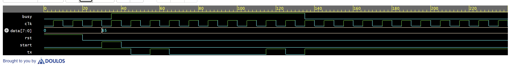
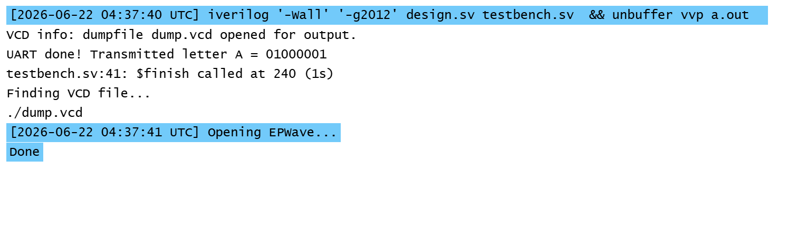

# 📶 UART Transmitter in Verilog

> 4-state FSM · Serial communication · 
> EPWave waveform verification · EDA Playground

---

## 📊 Results

### EPWave Waveform — Letter 'A' Transmitted

### Simulation Log

---

## ✨ What it does

- Implements UART transmitter as a 4-state FSM
- Transmits 8-bit data serially, LSB first
- Start bit signals receiver "data coming"
- Stop bit signals receiver "transmission done"
- Busy flag prevents data collision during transmission

---

## 🔄 FSM States

| State | tx value | What happens |
|-------|----------|-------------|
| IDLE | 1 (HIGH) | Wait for start signal |
| START | 0 (LOW) | Send wake-up bit to receiver |
| DATA | shift_reg[0] | Send 8 bits one by one, LSB first |
| STOP | 1 (HIGH) | Signal transmission complete |

---

## 🧠 Key Verilog Concepts

| Concept | Implementation |
|---------|---------------|
| FSM | 4-state machine using case statement |
| Sequential logic | always @(posedge clk) — clock driven |
| Non-blocking assignment | <= used throughout |
| Shift register | shift_reg >> 1 shifts bits out LSB first |
| Parameters | IDLE/START/DATA/STOP named constants |
| Reset logic | Synchronous reset to IDLE state |

---

## 🔌 Connection to Real World

This is the exact protocol used in:
- Arduino serial communication (Serial.print())
- GPS modules sending location data
- Bluetooth modules transmitting data
- My SmartAir project — ESP32 sending sensor data to Python

---

## ▶️ How to Run

Open on EDA Playground (free, browser-based):
[👉 Run this project](https://edaplayground.com/x/gr5B)

Settings:
Language  : SystemVerilog/Verilog

Simulator : Icarus Verilog 12.0

✅ Open EPWave after run
---

## 📁 Files

| File | Description |
|------|-------------|
| design.sv | UART transmitter FSM |
| testbench.sv | Testbench — transmits letter 'A' |

---

## 🛠️ Tech Stack

Verilog HDL · Icarus Verilog · EPWave · EDA Playground

---

## 👩‍💻 Built by

**Aagya** — EEE/ECE Student @ Kathmandu University

